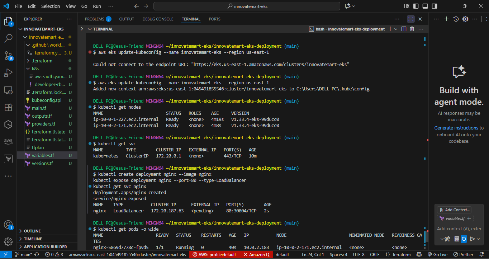
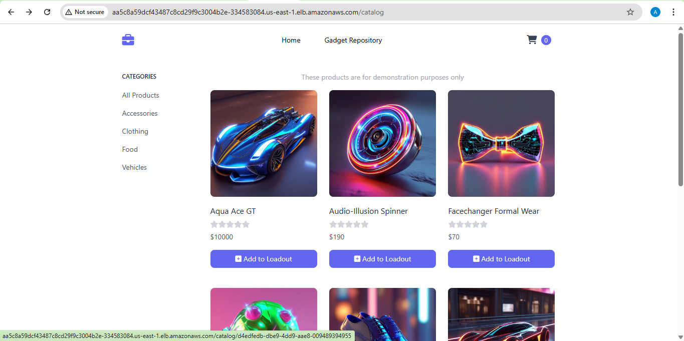
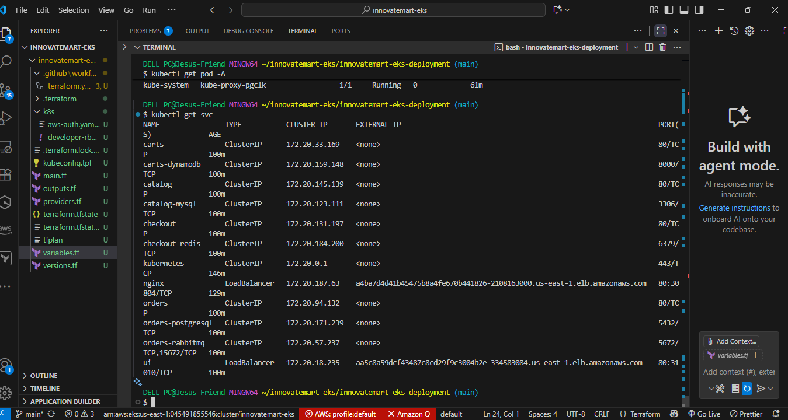
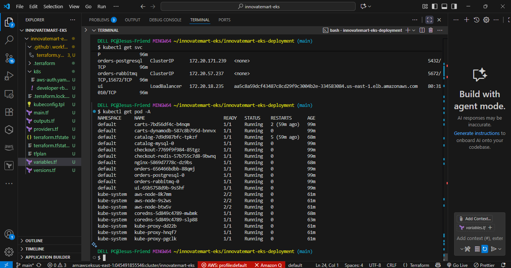
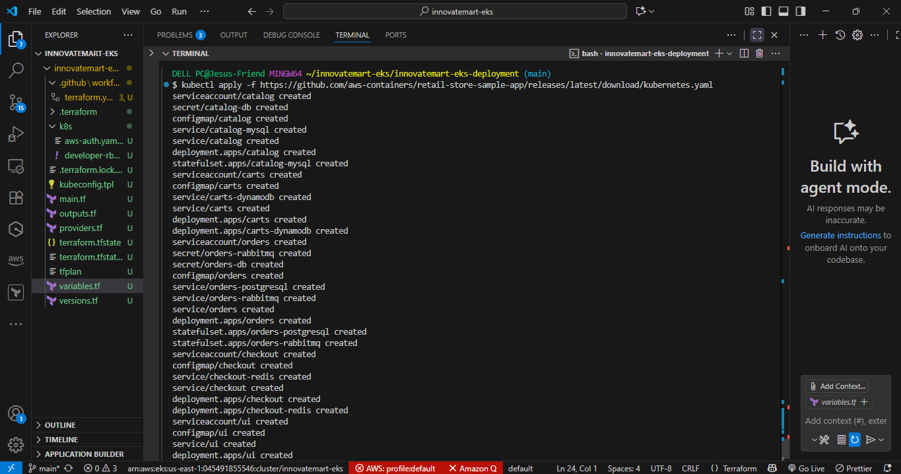
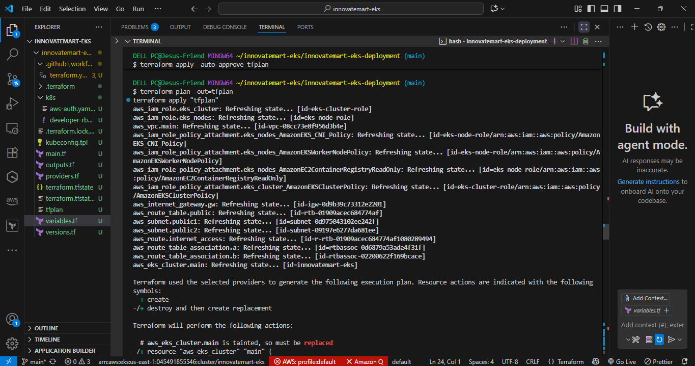

# InnovateMart EKS Deployment – Project Bedrock

## Overview

This repository contains the complete solution for InnovateMart’s “Project Bedrock” assessment. The goal was to deploy the retail-store-sample-app to a production-grade Kubernetes environment on AWS EKS, using Infrastructure as Code (IaC), automation, and best practices for security and scalability.


---

## Project Structure

```
innovatemart-eks-deployment/
├── terraform/                         # Terraform modules and root configs for AWS infra
│   ├── modules/                       # Reusable Terraform modules (vpc, eks, rds, etc.)
│   ├── environments/                  # Environment-specific configs (dev, prod, etc.)
│   ├── main.tf                        # Root Terraform configuration
│   ├── variables.tf                   # Input variables
│   ├── outputs.tf                     # Output values
│   └── backend.tf                     # Remote state backend config
├── k8s-manifests/                     # Kubernetes manifests for app and dependencies
│   ├── base/                          # Base manifests (deployments, services, etc.)
│   ├── overlays/                      # Environment overlays (dev, prod, etc.)
│   └── secrets/                       # Encrypted secrets (SOPS or SealedSecrets)
├── .github/
│   └── workflows/                     # GitHub Actions CI/CD pipeline definitions
│       ├── terraform-plan.yml
│       └── terraform-apply.yml
├── scripts/                           # Helper scripts (bootstrap, cleanup, etc.)
├── docs/                              # Additional documentation and diagrams
│   ├── architecture.png               # Architecture diagram(s)
│   └── usage.md                       # Usage and troubleshooting guides
├── .gitignore                         # Git ignore rules
├── .editorconfig                      # Editor configuration
├── .pre-commit-config.yaml            # Pre-commit hooks configuration
├── README.md                          # This documentation
└── LICENSE                            # Project license
```

---

## Architecture Overview

- **AWS VPC**: Custom VPC with public/private subnets for secure networking.
- **EKS Cluster**: Managed Kubernetes cluster for microservices deployment.
- **IAM Roles/Policies**: Least-privilege roles for EKS, nodes, and developer access.
- **In-Cluster Dependencies**: MySQL, PostgreSQL, DynamoDB Local, Redis, RabbitMQ as containers.
- **CI/CD**: Automated Terraform deployment via GitHub Actions.
- **(Bonus)**: Managed RDS, DynamoDB, ALB Ingress, SSL, and Route 53 (see below).

---

## Step-by-Step Implementation

1. **Folder & Repo Setup**
    - Created a new project folder: `innovatemart-eks-deployment`.
    - Initialized a new Git repository and pushed to GitHub.

2. **Infrastructure as Code (Terraform)**
    - Wrote Terraform modules to provision:
      - VPC with public/private subnets across multiple AZs.
      - EKS cluster and managed node groups.
      - IAM roles/policies for EKS and nodes.
    - Used outputs to generate kubeconfig for cluster access.

3. **Application Deployment**
    - Cloned the `retail-store-sample-app` repo.
    - Created Kubernetes manifests for all microservices and in-cluster dependencies.
    - Deployed manifests using `kubectl apply -f k8s-manifests/`.

4. **Developer IAM User**
    - Created a dedicated IAM user with read-only permissions to EKS resources.
    - Generated access keys and documented how to configure `kubectl` for this user.

5. **CI/CD Pipeline**
    - Configured GitHub Actions workflows:
      - `terraform-plan` on feature branches.
      - `terraform-apply` on main branch merges.
    - Used GitHub Secrets for AWS credentials (never hardcoded).

6. **Bonus Objectives (If Attempted)**
    - Provisioned RDS (PostgreSQL/MySQL) and DynamoDB via Terraform.
    - Updated app configs/secrets to use managed databases (no plaintext secrets).
    - Installed AWS Load Balancer Controller and set up Ingress/ALB.
    - Documented domain/SSL setup with Route 53 and ACM.

---

## Developer Access

- **IAM User**: `innovatemart-dev-readonly`
- **Permissions**: Read-only access to EKS cluster (describe pods, view logs, etc.)
- **Kubeconfig Setup**:
  1. Install `awscli` and `kubectl`.
  2. Configure AWS CLI:
      ```
      aws configure --profile innovatemart-dev-readonly
      ```
  3. Generate kubeconfig:
      ```
      aws eks update-kubeconfig --region <region> --name <cluster-name> --profile innovatemart-dev-readonly
      ```
  4. Use `kubectl` to view resources.

---

## CI/CD Pipeline

- **Branching Strategy**: GitFlow (feature branches for development, main for production).
- **Workflows**:
  - `terraform-plan.yml`: Runs on PRs/feature branches.
  - `terraform-apply.yml`: Runs on main branch merges.
- **Secrets Management**: AWS credentials stored in GitHub Secrets.

---

---

## 📸 Project Screenshots

Below are key screenshots that demonstrate the setup, deployment, and running state of the InnovateMart EKS project.

### Cluster & Nodes


### Load Balancer & Access
  
  


### Application & Pods
  
  


### Terraform & Automation
  


### Extra Logs & Debugging
  
  
  
  
  


---


---

## Accessing the Application

1. **UI Endpoint**: [https://your-domain.com](http://aa5c8a59dcf43487c8cd29f9c3004b2e-334583084.us-east-1.elb.amazonaws.com
) 
2. **Kubeconfig**: See [Developer Access](#developer-access) above.
3. 

---

## Repository Link

[GitHub Repository](<https://github.com/cwebhunter01/innovatemart-eks-deployment>)

---

## Summary

This project delivers a secure, automated, and production-ready EKS deployment for InnovateMart, meeting all core and bonus requirements of the assessment. All steps, from repo setup to CI/CD automation and developer onboarding, are documented for clarity and reproducibility.
